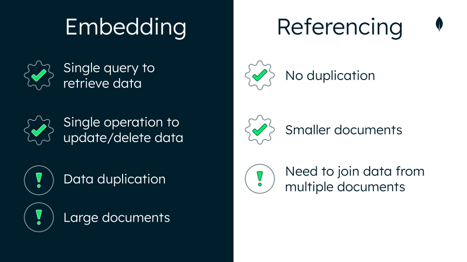

# MongoDB Data Modeling Intro

---

## Lesson 1: Introduction to Data Modeling

### Question 1
**Which of the following statements is/are true about data modeling?** *(Select all that apply)*

- **a. Data modeling is the process of defining how data is stored.**
  - **Correct**: Defining how data is stored is one function of data modeling. Data modeling helps you use your data effectively to meet information needs.

- **b. Data modeling is the process of defining the relationships that exist among different entities in your data.**
  - **Correct**: Defining the relationships that exist among different entities in your data is one function of data modeling. Data modeling enables you to document data requirements for applications and identify errors in development plans before any code is written.

- **c. Data modeling is the process of collecting data.**
  - **Incorrect**

---

### Question 2
**Which of the following are benefits of a proper data model?** *(Select all that apply)*

- **a. A proper data model makes it easier to manage your data.**
  - **Correct**: A proper data model makes it easier to manage your data. It will sustain growing data volumes and adjust easily to the addition or deletion of data.

- **b. A proper data model makes queries more efficient.**
  - **Correct**: A proper data model makes queries more efficient. It helps developers understand the database and tune it for fast performance, which makes reading and writing to the database faster.

- **c. A proper data model uses less memory and CPU.**
  - **Correct**: A proper data model uses less memory and CPU. Data modeling helps you better estimate and model memory requirements.

- **d. A proper data model reduces costs.**
  - **Correct**: A proper data model can reduce costs by using your database more efficiently. Data modeling catches errors and oversights early, when they are easier to fix.

---

### Question 3
**Which of the following is a benefit of the document model?** *(Select one)*

- **a. The document model does not enforce any document structure by default. This means that documents even in the same collection can have different structures.**
  - **Correct**: The document model does not enforce any document structure by default. This means that documents, even in the same collection can have different structures.

- **b. The document model makes having a schema useless.**
  - **Incorrect**

- **c. The document model supports only simple relationships among data to make data wrangling easier.**
  - **Incorrect**

---

## Lesson 2: Types of Data Relationships

### Question 1
**Which of the following are common types of relationships that are found in every database?** *(Select all that apply)*

- **a. One-to-one relationship**
  - **Correct**: A one-to-one relationship is one of the most common types of relationships found in a database. One-to-one is a relationship where a data entity in one set is connected to exactly one data entity in another set.

- **b. One-to-many relationship**
  - **Correct**: A one-to-many relationship is one of the most common types of relationships found in a database. One-to-many is a relationship where a data entity in one set is connected to any number of data entities in another set.

- **c. Many-to-many relationship**
  - **Correct**: A many-to-many relationship is one of the most common types of relationships found in a database. Many-to-many is a relationship where any number of data entities in one set are connected to any number of data entities in another set.

- **d. One-to-zillions relationship**
  - **Incorrect**

---

### Question 2
**What is the type of relationship shown in the following document?** *(Select one)*

```json
{
    "_id": ObjectId("00000001"),
    "name": "Marnie Dupree",
    "grade": "Freshman",
    "studentId": 123456,
    "email": "mdupree@college.edu"
}
```

- **a. One-to-one relationship**
  - **Correct**: There is a one-to-one relationship in this document. This is a document for a single student that contains her unique identifying fields.

- **b. One-to-many relationship**
  - **Incorrect**

- **c. Many-to-many relationship**
  - **Incorrect**

---

## Lesson 3: Modeling Data Relationships

### Question 1
**A legacy bank database has been ported to MongoDB, resulting in a set of collections that were mapped to their original tables.**

**You're tasked with redesigning the `accounts` collection of the banking database to make the information clearer. The bank would like you to keep the customers' contact information and account information separate.**

**The following is a sample document in the `accounts` collection:**

```json
{
  "account_id": "MDB653115886",
  "account_holder": "Herminia Mckinney",
  "account_type": "savings",
  "balance": 6617.34,
  "street_num": 123,
  "street": "Main St",
  "city": "Tulsa",
  "state": "OK",
  "zip": 74008,
  "country": "USA",
  "home_phone": 1234567890,
  "cell_phone": 1111111111,
  "transfers": [
    ...
  ]
}
```

**Which of the following actions can be made to improve this schema? Consider the following requirements:**
- Preserve the one-to-one relationship among all the fields.
- Keep the contact and account information separate.
- Store data together that is accessed together.

> **Hint**: Remember that you can embed subdocuments and create separate collections.

- **a. Create two collections: one for `accounts` and one for `customer_info`.**
  - **Correct**: Creating two collections, one for `accounts` and one for `customer_info`, aligns with the customer's requirements. It also ensures that data that is accessed together is stored together.

- **b. Embed the phone numbers as a subdocument.**
  - **Correct**: Embedding the phone numbers as a subdocument can improve the schema, and it ensures that data that is accessed together is stored together.

- **c. Create two collections that have no overlapping fields.**
  - **Incorrect**: Creating two collections that have no overlapping fields would not keep related information together, as there would not be references to link the two collections. This would not follow the principle of storing data together that is accessed together.

- **d. Keep the current schema as is.**
  - **Incorrect**: Keeping the current schema as is would not be the best option here given the requirements. The current schema does not keep contact information and account information separate, and it does not follow the principle of storing data together that is accessed together.

---

## Lesson 4: Embedding Data in Documents

### Question 1
**Which of the following statements is/are true about embedding data in documents?** *(Select all that apply)*

- **a. Embedding data in documents simplifies queries.**
  - **Correct**: Embedding data simplifies queries because it avoids application joins. It fulfills the principle that data that is accessed together should be stored together.

- **b. Embedding data in documents improves the overall performance of queries.**
  - **Correct**: Embedding data provides better performance for read operations. Embedded documents enable you to store all kinds of related information in a single document.

- **c. Embedding data in documents makes your document smaller over time.**
  - **Incorrect**: Over time, embedding data in a single document can make your document increasingly larger as you add data. This can lead to excessive memory and add latency for reads because large documents must be read into memory in full.

- **d. Embedding data in documents never results in an unbounded document.**
  - **Incorrect**: When embedding data, you might structure your document in a way that data is added continuously, without limit. This creates an unbounded document, which might exceed the maximum BSON document size of 16 MB.

---

### Question 2
**Which of the following relationship types often use embedding?** *(Select all that apply)*

- **a. One-to-one relationship**
  - **Correct**: With MongoDB, embedding a one-to-one relationship means putting the two pieces of information in the same document. You could also opt to use a subdocument to group related information, such as the components of an address.

- **b. One-to-many relationship**
  - **Correct**: Embedding is often used when there are one-to-many relationships in the data that's being stored. MongoDB recommends embedding documents to simplify queries and improve overall query performance.

- **c. Many-to-many relationship**
  - **Correct**: Embedding is often used when there are many-to-many relationships in the data that's being stored. MongoDB recommends embedding documents to simplify queries and improve overall query performance. It is important to note that embedding this type of relationship may introduce data duplication.

---

## Lesson 5: Referencing Data in Documents

### Embedding vs. Referencing
Here's a quick summary of the pros and cons of embedding vs. referencing in MongoDB:



---

### Question 1
**Which of the following statements is/are true about referencing data in documents?** *(Select all that apply)*

- **a. Referencing data in documents avoids duplication of data.**
  - **Correct**: Referencing allows you to store data in two different collections and ensure that the collections are related. This avoids duplication of data.

- **b. Referencing data in documents may result in smaller documents.**
  - **Correct**: Referencing avoids duplication of data and, in most cases, results in smaller documents.

- **c. Referencing data in documents links documents by using the same field.**
  - **Correct**: References save the `_id` field of one document in another document as a link between the two.

- **d. Referencing data in documents improves read performance.**
  - **Incorrect**

---

### Question 2
**Imagine the following are a sample of documents from a `users` collection:**

```json
[
  {
    "id": "AL001",
    "name": "Ella Richardson"
  },
  {
    "id": "AL002",
    "name": "Jackie Thomas"
  },
  {
    "id": "AL003",
    "name": "Justin McDonald"
  }
]
```

**Consider the following document from a `posts` collection, which contains data about a blog post and its comments. Which field is used as a reference?** *(Select one)*

```json
{
    "author": "Aileen Long",
    "title": "Learn MongoDB in 30 Mins",
    "published_date": ISODate("2020-05-18T14:10:30Z"),
    "tags": ["mongodb", "introductory", "database", "nosql"],
    "comments": [
        {
            "comment_id": "LM001",
            "user_id": "AL001",
            "comment_date": ISODate("2020-05-19T14:22:00Z"),
            "comment": "Great read!"
        },
        {
            "comment_id": "LM002",
            "user_id": "AL002",
            "comment_date": ISODate("2020-06-01T08:00:00Z"),
            "comment": "So easy to understand - thanks!"
        }
    ]
}
```

- **a. `comment_id`**
  - **Incorrect**

- **b. `comments`**
  - **Incorrect**

- **c. `date`**
  - **Incorrect**

- **d. `user_id`**
  - **Correct**: `user_id` is a reference to a document in the `users` collection. [Reference](https://www.mongodb.com/docs/manual/reference/database-references/)

---

## Lesson 6: Scaling a Data Model

### Question 1
**What are the effects of creating unbounded documents when embedding data?** *(Select all that apply)*

- **a. Unbounded documents impact write performance.**
  - **Correct**: Embedding data will make the document larger and impact write performance. As more data is added to each document, the entire document is rewritten into MongoDB data storage.

- **b. Unbounded documents improve pagination performance.**
  - **Incorrect**

- **c. Unbounded documents cause storage problems.**
  - **Correct**: Unbounded documents caused by embedding will eventually run into storage problems by exceeding the maximum document size of 16 MB.

---

### Question 2
**What is the recommended way to avoid the unbounded document sizes that may result from embedding?** *(Select one)*

- **a. Break data into multiple collections and use references.**
  - **Correct**: To prevent unbounded document sizes that may result from embedding, you can break up your data into multiple collections and use references to keep frequently accessed data together.

- **b. Break data into multiple databases.**
  - **Incorrect**

- **c. Separate documents to store on different servers.**
  - **Incorrect**

---

### Question 3
**What is MongoDB's principle for how you should design your data model?** *(Select one)*

- **a. Data that is accessed together should be stored together.**
  - **Correct**: Data that is accessed together should be stored together. How you model your data depends entirely on your particular application's data access patterns. You want to structure your data to match the ways that your application queries and updates it.

- **b. Data that is collected in the same day should be stored together.**
  - **Incorrect**

- **c. Data that is not in a one-to-one relationship should be stored together.**
  - **Incorrect**

---

## Lesson 7: Using Atlas Tools for Schema Help

### Question 1
**Which tab in Data Explorer shows ways to improve your schemas?** *(Select one)*

- **a. Indexes**
  - **Incorrect**

- **b. Schema Anti-Patterns**
  - **Correct**: The Schema Anti-Patterns tab highlights any issues in the collection and provides details to resolve them. You can improve your schema by resolving the anti-patterns that are shown.

- **c. Find**
  - **Incorrect**

---

### Question 2
**What is the minimum Atlas Cluster tier that you must have to use the Performance Advisor tool?** *(Select one)*

- **a. M0**
  - **Incorrect**

- **b. M10**
  - **Correct**: The Performance Advisor tool is available in M10+ cluster tiers.

- **c. M30**
  - **Incorrect**

---

## Conclusion

### Introduction to MongoDB Data Modeling
In this unit, you learned how to:
- Explain the purpose of data modeling.
- Identify the types of data relationships (one to one, one to many, many to many).
- Model data relationships.
- Identify the differences between embedded and referenced data models.
- Scale a data model.
- Use Atlas Tools for schema help.

### Resources
Use the following resources to learn more about the basics of data modeling:

- **Lesson 01: Introduction to Data Modeling**
  - Data Modeling Introduction
  - Separating Data That is Accessed Together
- **Lesson 02: Types of Data Relationships**
  - Data Model Design
  - Model Relationships Between Documents
  - Embedding MongoDB
  - MongoDB Schema Design Best Practices
- **Lesson 03: Modeling Data Relationships**
  - Data Model Design
  - Model Relationships Between Documents
- **Lesson 04: Embedding Data in Documents**
  - Embedding MongoDB
  - Model One-to-One Relationships with Embedded Documents
  - Model One-to-Many Relationships with Embedded Documents
- **Lesson 05: Referencing Data in Documents**
  - Normalized Data Models
  - Model One-to-Many Relationships with Document References
- **Lesson 06: Scaling a Data Model**
  - Operational Factors and Data Models
  - Performance Best Practices: MongoDB Data Modeling and Memory Sizing
- **Lesson 07: Using Atlas Tools for Schema Help**
  - A Summary of Schema Design Anti-Patterns and How to Spot Them
