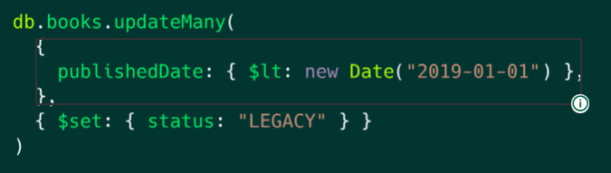

# MongoDB CRUD Operations: Replace and Delete Documents

---

## Lesson 1: Replacing a Document in MongoDB

### Code Summary: Replacing a Document in MongoDB
To replace documents in MongoDB, we use the `replaceOne()` method. The `replaceOne()` method takes the following parameters:
- `filter`: A query that matches the document to replace.
- `replacement`: The new document to replace the old one with.
- `options`: An object that specifies options for the update.

In the previous video, we use the `_id` field to filter the document. In our replacement document, we provide the entire document that should be inserted in its place. Here's the example code:

```javascript
db.books.replaceOne(
  {
    _id: ObjectId("6282afeb441a74a98dbbec4e"),
  },
  {
    title: "Data Science Fundamentals for Python and MongoDB",
    isbn: "1484235967",
    publishedDate: new Date("2018-5-10"),
    thumbnailUrl:
      "https://m.media-amazon.com/images/I/71opmUBc2wL._AC_UY218_.jpg",
    authors: ["David Paper"],
    categories: ["Data Science"],
  }
)
```

---

### Question 1
**Which of the following statements regarding the `replaceOne()` method for the MongoDB Shell (`mongosh`) are true?** *(Select all that apply)*

- **a. This method is used to replace a single document that matches the filter document.**
  - **Correct**: The `replaceOne()` method is used to replace a single document that matches the filter document.

- **b. This method accepts a filter document, a replacement document, and an optional options document.**
  - **Correct**: The `replaceOne()` method accepts a filter document, a replacement document, and an optional options document.

- **c. This method can replace multiple documents in a collection.**
  - **Incorrect**: The `replaceOne()` method is used to replace a single document that matches the filter document.

- **d. This method returns a document containing an acknowledgement of the operation, a matched count, modified count, and an upserted ID (if applicable).**
  - **Correct**: The `replaceOne()` method returns a document containing an acknowledgement of the operation, a matched count, modified count, and an upserted ID (if applicable).

---

### Question 2
**You want to replace the following document from the `birds` collection with a new document that contains additional information on recent sightings, the scientific name of each species, and wingspan. What field should you use in the filter document to ensure that this specific document is replaced?** *(Select one)*

```json
{
  "_id": ObjectId("6286809e2f3fa87b7d86dccd"),
  "common_name": "Morning Dove",
  "habitat": ["urban areas", "farms", "grassland"],
  "diet": ["seeds"]
}
```

- **a. `{ _id: ObjectId("6286809e2f3fa87b7d86dccd") }`**
  - **Correct**: Including the `_id` field as the filter document ensures that you'll replace this specific document by using `replaceOne()`.

- **b. `{ diet: ["seeds"] }`**
  - **Incorrect**: `{ diet: ["seeds"] }` is not a unique field, so you cannot ensure that you will replace this specific document. If you use the `diet` field as the filter, MongoDB will replace the first document that contains `{ diet: ["seeds"] }`.

- **c. `{ habitat: ["urban areas"] }`**
  - **Incorrect**: `{ habitat: ["urban areas"] }` is not a unique field, so you cannot ensure that you will replace this specific document. If you use the `habitat` field as the filter, MongoDB will replace the first document that contains `{ habitat: ["urban areas"] }`.

- **d. `{ scientific_name: "Zenaida macroura" }`**
  - **Incorrect**: The document that you want to replace does not contain `{ scientific_name: "Zenaida macroura" }`. Using `{ scientific_name: "Zenaida macroura" }` as the filter will replace another document.

---

## Lesson 2: Updating MongoDB Documents by Using updateOne()

### Code Summary: Updating MongoDB Documents by Using updateOne()
The `updateOne()` method accepts a filter document, an update document, and an optional options object. MongoDB provides update operators and options to help you update documents. In this section, we'll cover three of them: `$set`, `upsert`, and `$push`.

#### $set
The `$set` operator replaces the value of a field with the specified value, as shown in the following code:
```javascript
db.podcasts.updateOne(
  {
    _id: ObjectId("5e8f8f8f8f8f8f8f8f8f8f8"),
  },
  {
    $set: {
      subscribers: 98562,
    },
  }
)
```

#### upsert
The `upsert` option creates a new document if no documents match the filtered criteria. Here's an example:
```javascript
db.podcasts.updateOne(
  { title: "The Developer Hub" },
  { $set: { topics: ["databases", "MongoDB"] } },
  { upsert: true }
)
```

#### $push
The `$push` operator adds a new value to an array field. Here's an example:
```javascript
db.podcasts.updateOne(
  { _id: ObjectId("5e8f8f8f8f8f8f8f8f8f8f8") },
  { $push: { hosts: "Nic Raboy" } }
)
```

---

### Question 1
**You want to add an element to the `items` array field in the `sales` collection. To do this, what should you include in the update document?** *(Select one)*

- **Option A**: `{ $set: { items: [{ "name": "tablet", "price": 200 }] } }`
- **Option B**: `{ $update: { items: [{ "name": "tablet", "price": 200 }] } }`
- **Option C**: `{ $push: { items: [{ "name": "tablet", "price": 200 }] } }`
- **Option D**: `{ $upsert: { items: [{ "name": "tablet", "price": 200 }] } }`

Options:
- **a. Option A**
  - **Incorrect**: The `$set` operator replaces the value of a field with the specified value. This code example would replace the value of the `items` field. It would not add an element to the existing array.

- **b. Option B**
  - **Incorrect**: This syntax is invalid. `$update` is not a MongoDB operator.

- **c. Option C**
  - **Correct**: The `$push` operator adds an element to an array field. In this example, you will add an array element for a tablet.

- **d. Option D**
  - **Incorrect**: This syntax is invalid. The `upsert` option can add a document to a collection if it does not already exist. `upsert` cannot be used to update the value of a field.

---

### Question 2
**Air France has recently passed inspection. In the following document, you need to update the `result` field from `"Fail"` to `"Pass"`. To do this, what should you include in your update document?** *(Select one)*

```json
{
  "_id": ObjectId("56d61033a378eccde8a837f9"),
  "id": "31041-2015-ENFO",
  "certificate_number": 3045325,
  "business_name": "AIR FRANCE",
  "date": "Jun  9 2015",
  "result": "Fail",
  "sector": "Travel Agency - 440",
  "address": {
    "city": "JAMAICA",
    "zip": 11430,
    "street": "JFK INTL AIRPORT BLVD",
    "number": 1
  }
}
```

- **Option A**: `{ $set: { result: "Pass" } }`
- **Option B**: `{ $upsert: { result: "Pass" } }`
- **Option C**: `{ $insert: { result: "Pass" } }`
- **Option D**: `{ $push: { result: "Pass" } }`

Options:
- **a. Option A**
  - **Correct**: The `$set` operator replaces the value of a field with the specified value, so using this update document would update the `result` field to `'Pass'`.

- **b. Option B**
  - **Incorrect**: This syntax is invalid. The `upsert` option can add a document to a collection if it does not already exist. `upsert` cannot be used as an update operator to update the value of a field.

- **c. Option C**
  - **Incorrect**: This syntax is invalid. `$insert` is not a MongoDB update operator.

- **d. Option D**
  - **Incorrect**: The `$push` operator adds an element to an array field. The `result` field is a string, not an array, so you cannot use the `$push` operator to update the value of `result`.

---

## Lesson 3: Updating MongoDB Documents by Using findAndModify()

### Code Summary: Updating MongoDB Documents by Using findAndModify()
The `findAndModify()` method is used to find and replace a single document in MongoDB. It accepts a filter document, a replacement document, and an optional options object. The following code shows an example:

```javascript
db.podcasts.findAndModify({
  query: { _id: ObjectId("6261a92dfee1ff300dc80bf1") },
  update: { $inc: { subscribers: 1 } },
  new: true,
})
```

---

### Question 1
**Using the `zips` collection, you write the following query. This query updates the population, which is stored in the `pop` field, in one zip code in Santa Fe, New Mexico. What will be returned?** *(Select one)*

```javascript
db.zips.findAndModify({
  query: { _id: ObjectId("5c8eccc1caa187d17ca72ee7") },
  update: { $set: { pop: 40000 } },
  new: true,
})
```

- **a. The updated document, which contains a population of 40000**
  - **Correct**: When the `new` option is set to `true`, `findAndModify()` returns the updated document. This query will return the updated document with a population of 40000.

- **b. The original document, prior to the update, which contains a population of 34054**
  - **Incorrect**: When the `new` option is set to `true`, `findAndModify()` returns the updated document. This query will return the updated document with a population of 40000.

- **c. All documents with a population of 40000**
  - **Incorrect**: `findAndModify()` will update and return a single document, not multiple documents.

- **d. A new document that contains only an `_id` field and a `pop` field**
  - **Incorrect**: `findAndModify()` will insert a new document only if the `upsert` option is set to `true`. This query does not include the `upsert` option.

---

### Question 2
**What would happen if you ran the following query on the `zips` collection? Note that there is currently no document for the city of Taos.** *(Select one)*

```javascript
db.zips.findAndModify({
  query: { zip: 87571 },
  update: { $set: { city: "TAOS", state: "NM", pop: 40000 } },
  upsert: true,
  new: true,
})
```

- **a. A new document would be inserted because the `new` option is set to `true`.**
  - **Incorrect**: When the `new` option is set to `true`, the updated version of a document is returned, regardless of whether that document is new or existing.

- **b. A new document would be inserted because the `upsert` option is set to `true`.**
  - **Correct**: When the `upsert` option is set to `true`, a new document will be inserted if one does not already exist. For existing documents, the `upsert` option will cause the document to be updated.

- **c. You would receive an error, because you cannot insert a new document when using the `findAndModify()` method.**
  - **Incorrect**: If you use `findAndModify()` to insert a new document without including the `upsert` option, you will receive an error or a `null` response, and the document will not be inserted. In this example, the document is inserted because the `upsert` option is set to `true`.

---

## Lesson 4: Updating MongoDB Documents by Using updateMany()

### Code Summary: Updating MongoDB Documents by Using updateMany()
To update multiple documents, use the `updateMany()` method. This method accepts a filter document, an update document, and an optional options object. The following code shows an example:

```javascript
db.books.updateMany(
  { publishedDate: { $lt: new Date("2019-01-01") } },
  { $set: { status: "LEGACY" } }
)
```

---

### Question 1
**Three computer science classes, with the `class_id`s of 377, 259, and 350, have earned 100 extra credit points by competing in a hackathon. You need to update the database so that all students who are in these classes receive extra credit points. Note that you will use the `grades` collection, which is in the `sample_training` database.**

**Which of the following queries will accomplish this goal?** *(Select one)*

- **Option A**:
  ```javascript
  db.grades.insertMany(
    {
      class_id: {
        $in: [ 377, 259, 350 ]
      },
    },
    {
      $push: {
        scores: [ 
          { type: 'extra credit', score: 100 }
        ]
      }
    }
  )
  ```

- **Option B**:
  ```javascript
  db.grades.updateMany(
    {
      class_id: {
        $in: [ 377, 259, 350 ]
      },
    },
    {
      $push: {
        scores: [ 
          { type: 'extra credit', score: 100 }
        ]
      }
    }
  )
  ```

- **Option C**:
  ```javascript
  db.grades.updateOne(
    {
      class_id: {
        $in: [ 377, 259, 350 ]
      },
    },
    {
      $push: {
        scores: [ 
          { type: 'extra credit', score: 100 }
        ]
      }
    }
  )
  ```

- **Option D**:
  ```javascript
  db.grades.findAndModify(
    {
      class_id: {
        $in: [ 377, 259, 350 ]
      },
    },
    {
      $push: {
        scores: [ 
          { type: 'extra credit', score: 100 }
        ]
      }
    }
  )
  ```

Options:
- **a. Option A**
  - **Incorrect**: `db.collection.insertMany()` is used to insert multiple documents. It does not update existing documents.

- **b. Option B**
  - **Correct**: Using `db.collection.updateMany()` enables you to update multiple documents at once.

- **c. Option C**
  - **Incorrect**: `db.collection.updateOne()` updates only one document. To update the grades of all students in these classes, you need to use another collection method.

- **d. Option D**
  - **Incorrect**: `db.collection.findAndModify()` requires a query field and an update field. Running this query will throw an error message.

---

### Question 2
**Select the area within the code snippet that corresponds to each question prompt.**

Where is the method for updating multiple documents at once? Where is the filter document defined? Where is the update document defined in this code snippet?



---

## Lesson 5: Deleting Documents in MongoDB

### Code Summary: Deleting Documents in MongoDB
To delete documents, use the `deleteOne()` or `deleteMany()` methods. Both methods accept a filter document and an options object.

#### Delete One Document
The following code shows an example of the `deleteOne()` method:
```javascript
db.podcasts.deleteOne({ _id: ObjectId("6282c9862acb966e76bbf20a") })
```

#### Delete Many Documents
The following code shows an example of the `deleteMany()` method:
```javascript
db.podcasts.deleteMany({ category: "crime" })
```

---

### Question 1
**United Airlines is the only airline that has a route from the Denver Airport (`DEN`) to the Northwest Arkansas Airport (`XNA`). It has decided to cancel this route due to low ridership.**

**Which of the following queries will delete the route? Note that these documents are contained in the `routes` collection in the `sample_training` database.** *(Select one)*

- **Option A**: `db.routes.deleteOne({ "airline.name": "United Airlines" })`
- **Option B**: `db.routes.delete({ "airline.name": "United Airlines" })`
- **Option C**: `db.routes.delete({ src_airport: "DEN", dst_airport: "XNA" })`
- **Option D**: `db.routes.deleteOne({ src_airport: "DEN", dst_airport: "XNA" })`

Options:
- **a. Option A**
  - **Incorrect**: This query would delete the first document that has the airline name of United Airlines. Instead, you need to delete the document that departs from Denver, where the `src_airport` field is set to `"DEN"` and lands in the Northwest Arkansas airport, where the `dst_airport` field is set to `"XNA"`.

- **b. Option B**
  - **Incorrect**: `db.collection.delete()` is not a valid collection method in MongoDB.

- **c. Option C**
  - **Incorrect**: Although the airports are correct, `db.collection.delete()` is not a valid collection method in MongoDB.

- **d. Option D**
  - **Correct**: The `db.collection.deleteOne()` method is used to delete a single document. The filter document contains the `src_airport` field with a value of `"DEN"` to specify a flight departing from Denver, and a `dst_airport` field with a value of `"XNA"` to specify a flight landing in the Northwest Arkansas Airport.

---

### Question 2
**Air Berlin has filed for bankruptcy and ceased operations. You need to update the `routes` collection to delete all documents that contain an airline name of Air Berlin. Which of the following queries should you use?** *(Select one)*

- **Option A**: `db.routes.deleteOne({ "airline.name": "Air Berlin" })`
- **Option B**: `db.routes.delete("Air Berlin")`
- **Option C**: `db.routes.deleteMany({ "airline.name": "Air Berlin" })`
- **Option D**: `db.routes.deleteMany("Air Berlin")`

Options:
- **a. Option A**
  - **Incorrect**: `db.collection.deleteOne()` deletes a single document. This query will delete one document for Air Berlin, not all documents containing Air Berlin.

- **b. Option B**
  - **Incorrect**: `db.collection.delete()` is not a valid method in MongoDB.

- **c. Option C**
  - **Correct**: This query will delete all documents that contain an airline name of Air Berlin.

- **d. Option D**
  - **Incorrect**: This syntax is incorrect. You need to include a query document that contains a field and a specified value.

---

## Conclusion

### MongoDB CRUD Operations: Replace and Delete Documents
In this unit, you learned how to modify query results with MongoDB. Specifically, you:
- Replaced a single document by using `db.collection.replaceOne()`.
- Updated a field value by using the `$set` update operator in `db.collection.updateOne()`.
- Added a value to an array by using the `$push` update operator in `db.collection.updateOne()`.
- Added a new field value to a document by using the `upsert` option in `db.collection.updateOne()`.
- Found and modified a document by using `db.collection.findAndModify()`.
- Updated multiple documents by using `db.collection.updateMany()`.
- Deleted a document by using `db.collection.deleteOne()`.

### Resources
Use the following resources to learn more about modifying query results in MongoDB:

- **Lesson 01: Replacing a Document in MongoDB**
  - MongoDB Docs: `replaceOne()`
- **Lesson 02: Updating MongoDB Documents by Using updateOne()**
  - MongoDB Docs: Update Operators
  - MongoDB Docs: `$set`
  - MongoDB Docs: `$push`
  - MongoDB Docs: `upsert`
- **Lesson 03: Updating MongoDB Documents by Using findAndModify()**
  - MongoDB Docs: `findAndModify()`
- **Lesson 04: Updating MongoDB Documents by Using updateMany()**
  - MongoDB Docs: `updateMany()`
- **Lesson 05: Deleting Documents in MongoDB**
  - MongoDB Docs: `deleteOne()`
  - MongoDB Docs: `deleteMany()`
