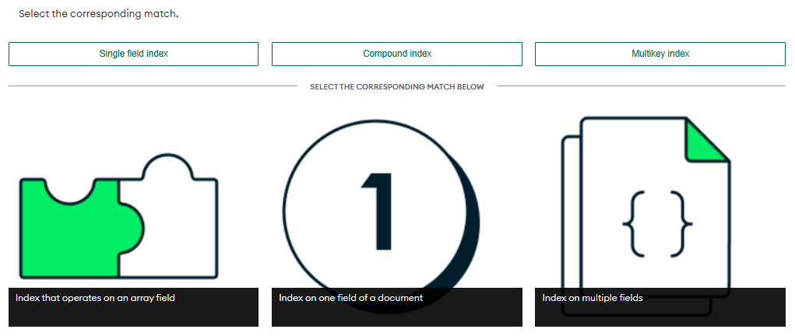
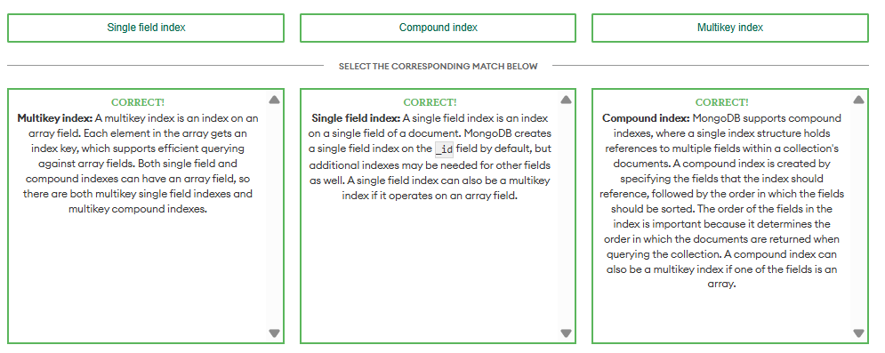

# MongoDB Indexes

---

## Lesson 1: Using MongoDB Indexes in Collections

### Question 1
**Which of the following statements about indexes are correct?** *(Select all that apply)*

- **a. Indexes are data structures that improve performance, support efficient equality matches and range-based query operations, and can return sorted results.**
  - **Correct**: Indexes are data structures that improve performance, support efficient equality matches and range-based query operations, and can return sorted results. Indexes achieve this by allowing MongoDB to perform only the work necessary to return the data that is requested, rather than scanning the entire collection.

- **b. Indexes are automatically created based on usage patterns.**
  - **Incorrect**: While users can create indexes on the data that's used most often to help improve the performance of a slow query, indexes are not automatically created based on usage patterns. However, MongoDB Atlas provides recommendations about which indexes to create or drop.

- **c. Indexes are used to make querying faster for users. One of the easiest ways to improve the performance of a slow query is create indexes on the data that is used most often.**
  - **Correct**: Indexes help make querying faster for users by only scanning the indexes to find the data that is requested.

- **d. When using an index, MongoDB reads every document in a collection to check if it matches the query that's being run.**
  - **Incorrect**: When indexes are available, MongoDB does not need to scan the entire collection to return the data that is requested by a query. Instead, MongoDB will only scan the indexes to find the data that is requested.

---

### Question 2
**Which of the following statements about indexes are true?** *(Select one)*

- **a. Indexes improve query performance and have no impact on write performance.**
  - **Incorrect**: While indexes improve query performance, they do come with a cost. For example, any time you run a write operation, all the indexes must be updated, which can be time-consuming.

- **b. Indexes improve query performance at the cost of write performance.**
  - **Correct**: Indexes improve query performance at the cost of write performance. For most use cases, this tradeoff is acceptable. Indexes should be used on data that is frequently queried or on queries that are infrequent but costly in terms of computational resources.

- **c. Indexes have no impact on query performance but improve write performance.**
  - **Incorrect**: Indexes improve query performance by allowing the database to use indexes to speed up the query process. However, indexes do come with a cost. For example, any time you run a write operation, all the indexes must be updated, which can be time-consuming.

- **d. Indexes have a negative impact on query performance but improve write performance.**
  - **Incorrect**: Indexes have a positive impact on query performance but come with a cost. For example, any time you run a write operation, all the indexes must be updated, which can be time-consuming.

---

### Question 3
**Match the index type to its corresponding description.**




- **Single field index**: A single field index is an index on a single field of a document. MongoDB creates a single field index on the `_id` field by default, but additional indexes may be needed for other fields as well. A single field index can also be a multikey index if it operates on an array field.
- **Compound index**: MongoDB supports compound indexes, where a single index structure holds references to multiple fields within a collection's documents. A compound index is created by specifying the fields that the index should reference, followed by the order in which the fields should be sorted. A compound index can also be a multikey index if one of the fields is an array.
- **Multikey index**: A multikey index is an index on an array field. Each element in the array gets an index key, which supports efficient querying against array fields. Both single field and compound indexes can have an array field, so there are both multikey single field indexes and multikey compound indexes.

---

## Lesson 2: Creating a Single Field Index in MongoDB

### Code Summary: Creating a Single Field Index
Review the code below, which demonstrates how to create a single field index in a collection.

#### Create a Single Field Index
Use `createIndex()` to create a new index in a collection. Within the parentheses of `createIndex()`, include an object that contains the field and sort order.

```javascript
db.customers.createIndex({
  birthdate: 1
})
```

#### Create a Unique Single Field Index
Add `{ unique: true }` as a second, optional parameter in `createIndex()` to force uniqueness in the index field values. Once the unique index is created, any inserts or updates including duplicate values in the collection for the index field(s) will fail.

```javascript
db.customers.createIndex(
  { email: 1 },
  { unique: true }
)
```
MongoDB only creates the unique index if there is no duplication in the field values for the index field(s).

#### View the Indexes Used in a Collection
Use `getIndexes()` to see all the indexes created in a collection.

```javascript
db.customers.getIndexes()
```

#### Check If an Index Is Being Used on a Query
Use `explain()` on a collection when running a query to see the Execution plan. This plan provides details of the execution stages (`IXSCAN`, `COLLSCAN`, `FETCH`, `SORT`, etc.):
- **`IXSCAN`**: Indicates the query is using an index and shows what index is being selected.
- **`COLLSCAN`**: Indicates a collection scan is performed, not using any indexes.
- **`FETCH`**: Indicates documents are being read from the collection.
- **`SORT`**: Indicates documents are being sorted in memory.

```javascript
db.customers.explain().find({
  birthdate: {
    $gt: ISODate("1995-08-01")
  }
})

db.customers.explain().find({
  birthdate: {
    $gt: ISODate("1995-08-01")
  }
}).sort({
  email: 1
})
```

---

### Question 1
**What is a single field index?** *(Select one)*

- **a. An index that supports efficient querying against one field**
  - **Correct**: A single field index is an index that supports efficient querying against a single field. By default, all collections have a single field index on the `_id` field, but users can define additional indexes that support important queries. A single field index is also a multikey index if the value of the field is an array.

- **b. An index that supports efficient querying against multiple fields**
  - **Incorrect**: An index that supports efficient queries against multiple fields is called a compound index.

- **c. An index that only supports efficient querying against fields with scalar values**
  - **Incorrect**: Single field indexes can also support efficient querying against a single array field.

- **d. An index that supports efficient querying against fields that are already indexed by another user-defined index**
  - **Incorrect**: A single field index doesn't support efficient querying against fields that are already indexed by another user-defined index. When a single field is already indexed—for example, by a compound index—creating an additional single field index can cause over-indexing and performance issues.

---

### Question 2
**You have a collection of customer details. The following is a sample document from the collection:**

```json
{
  "_id": { "$oid": "5ca4bbcea2dd94ee58162a6a" },
  "username": "hillrachel",
  "name": "Katherine David",
  "address": "55711 Janet Plaza Apt. 865\nChristinachester, CT 62716",
  "birthdate": { "$date": { "$numberLong": "582848134000" } },
  "email": "timothy78@hotmail.com",
  "Accounts": [
    { "$numberInt": "462501" },
    { "$numberInt": "228290" },
    { "$numberInt": "968786" },
    { "$numberInt": "515844" },
    { "$numberInt": "377292" }
  ],
  "tier_and_details": {}
}
```

**You create a single field index on the `email` field, with the unique constraint set to `true`:**

```javascript
db.customers.createIndex({ email: 1 }, { unique: true })
```

**What would happen if you attempt to insert a new document with an email that already exists in the collection?** *(Select one)*

- **a. The new document will be inserted and replace the old document in the collection.**
  - **Incorrect**: That is not how the unique constraint operates. Unique indexes ensure that indexed fields do not store duplicate values.

- **b. The new document will be inserted and the old document will remain in the collection.**
  - **Incorrect**: That is not how the unique constraint operates. Unique indexes ensure that indexed fields do not store duplicate values.

- **c. MongoDB will return a duplicate key error, and the document will be inserted.**
  - **Incorrect**: That is not how the unique constraint operates. While a duplicate key error would be returned, the new document would not be inserted.

- **d. MongoDB will return a duplicate key error, and the document will not be inserted.**
  - **Correct**: Unique indexes ensure that indexed fields do not store duplicate values. In this example, MongoDB will return a duplicate key error if you attempt to insert a new document with an email that already exists in the collection, as the unique constraint was set to `true`.

---

## Lesson 3: Creating a Multikey Index in MongoDB

### Code Summary: Creating a Multikey Index in MongoDB
Understanding Multikey Indexes: If a single field or compound index includes an array field, then the index is a multikey index.

#### Create a Single Field Multikey Index
Use `createIndex()` to create a new index in a collection. Include an object as a parameter that contains the array field and sort order. In this example `accounts` is an array field:

```javascript
db.customers.createIndex({
  accounts: 1
})
```

#### View the Indexes Used in a Collection
Use `getIndexes()` to see all the indexes created in a collection:

```javascript
db.customers.getIndexes()
```

#### Check If an Index Is Being Used on a Query
Use `explain()` on a collection when running a query to see the Execution plan:

```javascript
db.customers.explain().find({
  accounts: 627788
})
```

---

### Question 1
**What is a multikey index?** *(Select one)*

- **a. An index on one field only where the field is not an array**
  - **Incorrect**: A multikey index is any index where one of the indexed fields contains an array.

- **b. An index where one of the indexed fields contains an array**
  - **Correct**: Multikey indexes support efficient queries against array fields by creating an index key for each element in the array. This allows MongoDB to search for the index key of each element in the array rather than scan the entire array.

- **c. An index on more than one field where none of the fields are arrays**
  - **Incorrect**: That describes a standard compound index.

- **d. An index on more than one field where multiple fields are arrays**
  - **Incorrect**: In a compound multikey index, only one of the fields can be an array.

---

### Question 2
**What is the maximum number of array fields per multikey index?** *(Select one)*

- **a. `1`**
  - **Correct**: The maximum number of array fields per multikey index is 1. If an index has multiple fields, only one of them can be an array.

- **b. `3`**
  - **Incorrect**: The maximum number of array fields per multikey index is 1.

- **c. `5`**
  - **Incorrect**: The maximum number of array fields per multikey index is 1.

- **d. Unlimited**
  - **Incorrect**: The maximum number of array fields per multikey index is limited to 1.

---

## Lesson 4: Working with Compound Indexes in MongoDB

### Code Summary: Working with Compound Indexes in MongoDB
Review the code below, which demonstrates how to create a compound index in a collection.

#### Create a Compound Index
Use `createIndex()` to create a new index in a collection. Within the parentheses of `createIndex()`, include an object that contains two or more fields and their sort order:

```javascript
db.customers.createIndex({
  active: 1, 
  birthdate: -1,
  name: 1
})
```

#### Order of Fields in a Compound Index
The order of the fields matters when creating the index and the sort order. It is recommended to list the fields in the following order: **Equality**, **Sort**, and **Range**.
- **Equality**: Field(s) that match on a single field value in a query.
- **Sort**: Field(s) that order the results in a query.
- **Range**: Field(s) that filter in a range of valid values in a query.

The following query includes an equality match on the `active` field, a sort on `birthdate` (descending) and `name` (ascending), and a range query on `birthdate`:

```javascript
db.customers.find({
  birthdate: {
    $gte: ISODate("1977-01-01")
  },
  active: true
}).sort({
  birthdate: -1, 
  name: 1
})
```

An efficient index for this query is:
```javascript
db.customers.createIndex({
  active: 1, 
  birthdate: -1,
  name: 1
})
```

#### Cover a Query by the Index
An Index covers a query when MongoDB does not need to fetch data from memory because all the required data is already returned by the index.

By adding the projection `{ name: 1, birthdate: 1, _id: 0 }` to the query, we limit returned fields to only `name` and `birthdate`. When we run `explain()`, the execution plan shows two covered stages:
- **`IXSCAN`**: Index scan using the compound index.
- **`PROJECTION_COVERED`**: All required information is returned by the index; no need to fetch from memory.

```javascript
db.customers.explain().find(
  {
    birthdate: { $gte: ISODate("1977-01-01") },
    active: true
  },
  {
    name: 1,
    birthdate: 1, 
    _id: 0
  }
).sort({
  birthdate: -1,
  name: 1
})
```

---

### Question 1
**What is a compound index?** *(Select one)*

- **a. An index that supports queries that combine the field name and the value into one string**
  - **Incorrect**: An index that combines the field name and the value into a single string does not exist in MongoDB.

- **b. An index that supports queries against unknown or arbitrary fields**
  - **Incorrect**: An index that supports queries against unknown or arbitrary fields is a wildcard index.

- **c. An index that contains references to multiple fields within a document**
  - **Correct**: A compound index is an index that contains references to multiple fields within a document. Compound indexes are created by adding a comma-separated list of fields and their corresponding sort order to the index definition.

- **d. An index that supports queries that are run on two collections at the same time**
  - **Incorrect**: MongoDB does not support compound indexes spanning multiple collections.

---

### Question 2
**What is the recommended order of fields in a compound index?** *(Select one)*

- **a. Sort, Range, Equality**
  - **Incorrect**: Reconsider the ESR rule.

- **b. Range, Sort, Equality**
  - **Incorrect**: Reconsider the ESR rule.

- **c. Equality, Sort, Range**
  - **Correct**: The recommended order of indexed fields in a compound index is Equality, Sort, and Range (ESR rule). Optimized queries use the first field in the index, Equality, to determine which documents match the query. The second field, Sort, determines the order. The third field, Range, determines which documents to include in the result set.

- **d. The order of indexed fields is not important.**
  - **Incorrect**: The order of indexed fields is critical for query optimization.

---

## Lesson 5: Deleting MongoDB Indexes

### Code Summary: Deleting MongoDB Indexes
Review the code below, which demonstrates how to delete indexes in a collection.

#### View the Indexes Used in a Collection
Use `getIndexes()` to see all the indexes created in a collection. There is always a default index on the `_id` field, which cannot be deleted:

```javascript
db.customers.getIndexes()
```

#### Delete an Index
Use `dropIndex()` to delete an existing index from a collection. Within the parentheses of `dropIndex()`, include an object representing the index key or provide the index name as a string.

Delete index by name:
```javascript
db.customers.dropIndex('active_1_birthdate_-1_name_1')
```

Delete index by key:
```javascript
db.customers.dropIndex({
  active: 1,
  birthdate: -1, 
  name: 1
})
```

#### Delete All User Indexes
Use `dropIndexes()` to delete all indexes from a collection, with the exception of the default index on `_id`:

```javascript
db.customers.dropIndexes()
```

`dropIndexes()` can also accept an array of index names as a parameter:
```javascript
db.collection.dropIndexes([
  'index1name', 'index2name', 'index3name'
])
```

---

### Question 1
**What are the ramifications of deleting an index that is supporting a query?** *(Select one)*

- **a. The performance of the query will improve.**
  - **Incorrect**: Deleting an index supporting a query will not improve performance.

- **b. The performance of the query will be negatively affected.**
  - **Correct**: The performance of the query will be negatively affected by the deletion of the only index currently supporting that query, as MongoDB may have to perform a full collection scan (`COLLSCAN`).

- **c. The query will fail.**
  - **Incorrect**: Deleting the index won't cause the query to fail; it will just run much slower.

- **d. The query will perform as expected.**
  - **Incorrect**: Deleting a supporting index negatively impacts query performance.

---

### Question 2
**You have a collection of customer details. You have an index on the `email` field created using `db.customers.createIndex({ email: 1 })`. Before deleting it, you want to assess the impact of removing this index on the performance of the query without deleting it. To do this, which command should you use?** *(Select one)*

- **a. `dropIndex()`**
  - **Incorrect**: `dropIndex()` deletes the index completely.

- **b. `dropIndexes()`**
  - **Incorrect**: `dropIndexes()` deletes multiple indexes completely.

- **c. `getIndexes()`**
  - **Incorrect**: `getIndexes()` lists current indexes.

- **d. `hideIndex()`**
  - **Correct**: The `hideIndex()` command hides an index from the query planner (`db.customers.hideIndex({ email: 1 })`). MongoDB does not use hidden indexes for queries but continues to update them. This allows you to evaluate performance impact before permanently dropping the index.

---

## Conclusion

### MongoDB Indexes
In this unit, you learned what indexes are and how they improve performance. You reviewed and built different indexes:
- **Single-field index** (1 field)
- **Compound index** (2 to 32 fields)
- **Multikey index** (indexes containing an array field)
- **Index properties** (such as `unique`)

You used the following collection methods to manage indexes:
- `createIndex()`
- `dropIndex()`
- `dropIndexes()`
- `hideIndex()`

Finally, you learned how to view existing indexes using `getIndexes()` and analyze query execution plans using `explain()`.

### Resources
Use the following resources to learn more about indexes in MongoDB:

- **Lesson 01: Using MongoDB Indexes in Collections**
  - MongoDB Docs: Indexes
  - MongoDB Docs: Indexes Reference
- **Lesson 02: Creating a Single Field Index in MongoDB**
  - MongoDB Docs: `createIndex()`
  - MongoDB Docs: Unique Indexes
  - MongoDB Docs: Measure Index Use
  - MongoDB Docs: `getIndexes()`
- **Lesson 03: Creating a Multikey Index in MongoDB**
  - MongoDB Docs: Multikey Indexes
- **Lesson 04: Working with Compound Indexes in MongoDB**
  - MongoDB Docs: Compound Indexes
  - MongoDB Docs: Indexing Strategies
- **Lesson 05: Deleting MongoDB Indexes**
  - MongoDB Docs: `dropIndex()`
  - MongoDB Docs: `dropIndexes()`
