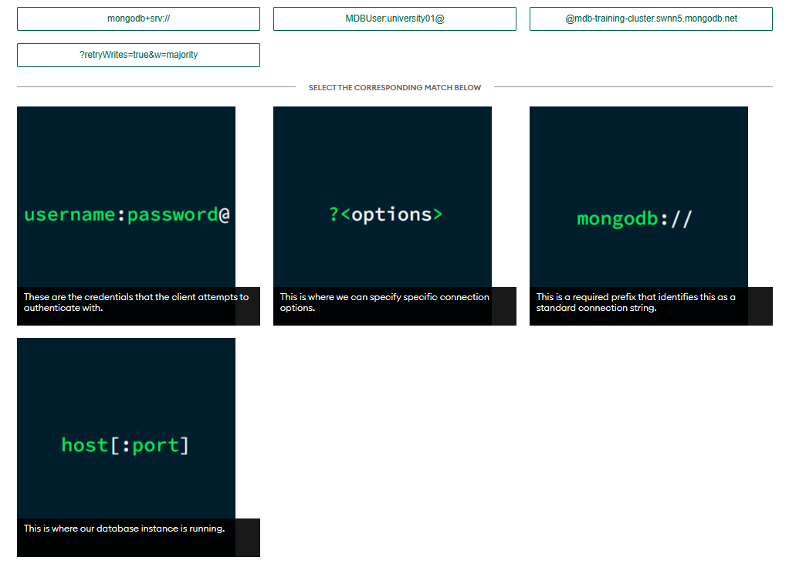
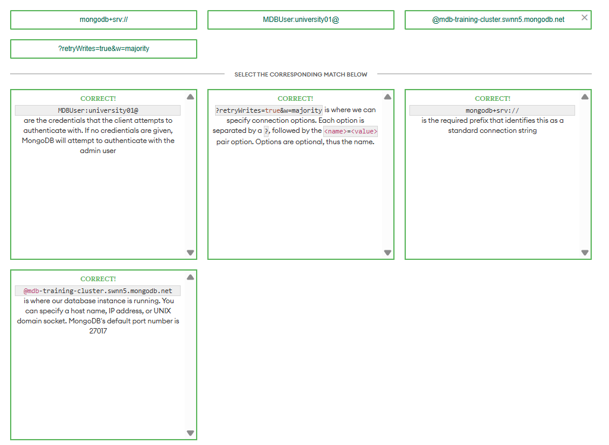

# Connecting to a MongoDB Database

---

## Lesson 1: Using MongoDB Connection Strings

### Question 1
**Which of the pre-formatted connection strings are available in the Atlas dashboard?** *(Select all that apply)*

- **a. Connect with the MongoDB Shell**
  - **Correct**: MongoDB provides a pre-formatted connection string to use with the MongoDB Shell. The connection string looks like the following:
    ```bash
    mongosh "mongodb+srv://mdb-training-cluster.swnn5.mongodb.net/myFirstDatabase" --apiVersion 1 --username MDBUser
    ```

- **b. Connect your application**
  - **Correct**: MongoDB provides a pre-formatted connection string to use when connecting to an application. The connection string looks like the following:
    ```text
    mongodb+srv://MDBUser:<password>@mdb-training-cluster.swnn5.mongodb.net/myFirstDatabase?retryWrites=true&w=majority
    ```

- **c. Connect using MongoDB Compass**
  - **Correct**: MongoDB provides a pre-formatted connection string to use with MongoDB Compass. The connection string looks like the following:
    ```text
    mongodb+srv://MDBUser:<password>@mdb-training-cluster.swnn5.mongodb.net/test
    ```

- **d. Connect with MongoDB Charts**
  - **Incorrect**: MongoDB Charts is a data visualization tool that you can use with your MongoDB data. Open the Atlas dashboard to check which connection strings are available.




---

## Lesson 2: Connecting to a MongoDB Atlas Cluster with the Shell

### Question 1
**Which REPL environment does the MongoDB Shell use?** *(Select one)*

- **a. Python**
  - **Incorrect**: The MongoDB Shell does not use a Python REPL environment. The MongoDB Shell uses a REPL environment that gives us access to JavaScript variables, functions, conditionals, loops, and control flow statements.

- **b. Node**
  - **Correct**: The MongoDB Shell uses a Node REPL environment. This means that we are able to use JavaScript variable declaration, function declaration, and loops.

- **c. Bash**
  - **Incorrect**: The MongoDB Shell does not use a Bash REPL environment. The MongoDB Shell uses a REPL environment that gives us access to JavaScript variables, functions, conditionals, loops, and control flow statements.

- **d. Perl**
  - **Incorrect**: The MongoDB Shell does not use a Perl REPL environment. The MongoDB Shell uses a REPL environment that gives us access to JavaScript variables, functions, conditionals, loops, and control flow statements.

---

### Question 2
**To connect your Atlas cluster with the MongoDB Shell, what do you need to run in the command line?** *(Select one)*

- **a. The `_id` of the document(s) you want to work with**
  - **Incorrect**: Before you start working with documents, you need to connect to your Atlas cluster with the MongoDB Shell.

- **b. The name of the collection that you want to use**
  - **Incorrect**: Before you start working with a particular collection, you need to connect to your Atlas cluster with the MongoDB Shell.

- **c. Your connection string**
  - **Correct**: You need to run your connection string in the command line to connect to your Atlas cluster with the MongoDB Shell. To find your connection string, click Connect in the Atlas dashboard and select the option for connecting with the MongoDB Shell.

---

## Lesson 3: Connecting to a MongoDB Atlas Cluster with Compass

### Question 1
**Which of the following describes MongoDB Compass?** *(Select one)*

- **a. A Node.js REPL environment that is used to interact with the database**
  - **Incorrect**: MongoDB Compass is not a Node REPL environment, but the MongoDB shell is a Node REPL environment. MongoDB Compass helps you work with your data in MongoDB.

- **b. A data visualization tool that allows you to create and embed visualizations in your application**
  - **Incorrect**: MongoDB Compass is not a data visualization tool, but MongoDB does offer a data visualization tool called Charts. MongoDB Compass helps you work with your data in MongoDB.

- **c. A tool that allows you to query, transform, and move data across Amazon S3 and Atlas clusters**
  - **Incorrect**: MongoDB Compass does not allow you to query, transform, and move data across Amazon S3 and Atlas clusters specifically. MongoDB offers a tool called Atlas Data Lake that performs those actions.

- **d. A graphical user interface (GUI) for querying, aggregating, and analyzing data in MongoDB**
  - **Correct**: MongoDB Compass is a graphical user interface (GUI) for querying, aggregating, and analyzing data in MongoDB.

---

## Lesson 4: Connecting to a MongoDB Atlas Cluster from an Application

### Question 1
**What does a MongoDB driver do?** *(Select one)*

- **a. Executes an aggregation pipeline**
  - **Incorrect**: MongoDB drivers can be used with the aggregation framework, but that is not the sole purpose of a MongoDB driver. MongoDB drivers allow you to use MongoDB with your applications.

- **b. Connects MongoDB to applications via programming languages**
  - **Correct**: MongoDB drivers provide a way to connect our database with our application.

- **c. Controls replication and sharding across servers**
  - **Incorrect**: MongoDB drivers do not handle replication and sharding; this is handled in Atlas. MongoDB drivers allow you to use MongoDB with your applications.

- **d. Creates different types of charts of our data**
  - **Incorrect**: MongoDB drivers do not perform any type of visualization. We can use MongoDB Charts for data visualization. MongoDB drivers allow you to use MongoDB with your applications.

---

### Question 2
**Visit the official MongoDB driver documentation. Which of the following languages have drivers that are supported by MongoDB?** *(Select all that apply)*

- **a. C#**
  - **Correct**: MongoDB provides a driver to connect to C# applications.

- **b. Go**
  - **Correct**: MongoDB provides a driver to connect to Go applications.

- **c. Node**
  - **Correct**: MongoDB provides a driver to connect to Node applications.

- **d. Pascal**
  - **Incorrect**: MongoDB does not support a Pascal driver. Visit the MongoDB driver documentation for the list of drivers that MongoDB supports.

---

## Lesson 5: Troubleshooting MongoDB Atlas Connection Errors

### Question 1
**How can you fix the following error?** *(Select one)*

```text
MongoServerSelectionError: connection <monitor> to 34.239.188.169:27017 closed
```

- **a. Update database access with the correct user credentials.**
  - **Incorrect**: This is an authentication error. You would have to update your database user if you were experiencing an authentication error. What are the other types of errors commonly experienced when trying to connect to MongoDB, and how do we address them?

- **b. Add your IP address in the Network Access panel in Atlas.**
  - **Correct**: This is a network access error. You need to check the Network Access panel to ensure that your desired IP address is on the allowlist. If not, you may experience a connection timeout.

- **c. Create a new database on your Atlas cluster.**
  - **Incorrect**: Creating a new database will not fix this error. How would you fix a network access error?

---

### Question 2
**How can we fix the following error?** *(Select all that apply)*

```text
MongoServerError: bad auth : Authentication failed.
```

- **a. Check that you are connecting to the correct database deployment.**
  - **Correct**: Even if you enter the correct username and password, you should confirm that you are connecting to the correct database deployment if you receive an authentication error.

- **b. Update your IP address in the Network Access panel.**
  - **Incorrect**: Updating your IP address in the Network Access panel would resolve a network access error. How do you resolve an authentication error?

- **c. Check that your username and password are spelled correctly in your connection string.**
  - **Correct**: Often, a simple misspelling of login credentials will result in an authentication error.

---

## Conclusion

### Connecting to a MongoDB Database
In this unit, you learned how to connect to Atlas by using:
- The MongoDB Shell
- MongoDB Compass
- Applications

Finally, you learned how to troubleshoot some common connection problems that can occur.

### Resources
Use the following resources to learn more about connecting to your database:

- **Lesson 01: Using MongoDB Connection Strings**
  - MongoDB Docs: Get Connection String
  - MongoDB Docs: Connection String URI Format
- **Lesson 02: Connecting to a MongoDB Atlas Cluster with the Shell**
  - MongoDB Docs: The MongoDB Shell
- **Lesson 03: Connecting to a MongoDB Atlas Cluster with Compass**
  - MongoDB Docs: MongoDB Compass
- **Lesson 04: Connecting to a MongoDB Atlas Cluster from an Application**
  - MongoDB Docs: Connect via Your Application
- **Lesson 05: Troubleshooting MongoDB Atlas Connection Errors**
  - MongoDB Docs: Troubleshoot Connection Issues
